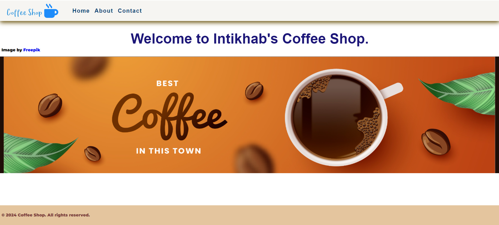

# Session 1: Building Your First Web Page: An Introduction to HTML, CSS, and JavaScript"

## Date Time 11-May-2024 at 09:00 AM IST

## Event URL: <https://www.meetup.com/dot-net-learners-house-hyderabad/events/300839711/>

## YouTube URL: <<https://www.youtube.com/watch?v=BBky8tK_dVY>

## Software/Tools
>
> 1. Text Editor (Visual studio Code)
> 2. GitHub Desktop
> 3. Git

## Resources/Productivity tools
>
> 1. <https://developer.mozilla.org/en-US/>
> 2. <https://docs.emmet.io/cheat-sheet/>
> 3. <https://code.visualstudio.com/docs/editor/emmet>
> 4. <https://cdnjs.com/libraries/font-awesome>
> 5. <https://fontawesome.com/search?q=apple&o=r>
> 6. <https://favicon.io/emoji-favicons/dizzy>
> 7. <https://colorhunt.co/>
> 8. <https://fonts.google.com/>
> 9. <https://svglogomaker.com/>

## Information


## Agenda

* Technologies and Starter app
* Overview of HTML, CSS, and JavaScript
* Creating a Simple Web Page.
* Publishing the web page using GitHub pages.

## Please refer to the Source Code of today's session for more details


## Big Picture



## 1. Technologies and Starter app

## 2. Overview of HTML, CSS, and JavaScript

* **HTML** is the foundation of web development. It defines the structure and content of web pages using markup tags. HTML tags are used to create elements such as headings, paragraphs, images, links, and forms.
  
* **CSS** (Cascading Style Sheets): CSS is used to style HTML elements and define their appearance on the web page. It allows developers to control aspects like layout, colors, fonts, and spacing. CSS can be written inline, embedded within HTML, or in external style sheets.
  
* **JavaScript** is a versatile programming language used to add interactivity and dynamic behavior to web pages. It enables features like form validation, animations and more. Like CSS JavaScript can be embedded within HTML, or in external JavaScript file.

## 3. Creating a Simple Web Page

Create a new repository in GitHub
>>
>> 1. On the top right corner, click on + and select 'New repository'


Create your repository using the basic template


## 2.  Setting branch policies

Go to Settings --> Branches, and select 'Add branch protection rule'


Under 'Branch name pattern' write main and select 'Require a pull request before merging'


After creating branch rules clone the prject.
Under 'Code', select 'Open with Github Desktop' to clone locally.


o open in VS Code, click on 'Open with Visual Studio Code'


Create the folder structure as shown below


Write this code in index.html
```text
<!DOCTYPE html>
<html lang="en">
  <head>
    <meta charset="UTF-8" />
    <meta name="viewport" content="width=device-width, initial-scale=1.0" />
    <link rel="icon" href="favicon.ico" type="image/x-icon" />
    <title>Coffee Shop</title>
    <link
      rel="stylesheet"
      href="https://cdnjs.cloudflare.com/ajax/libs/font-awesome/6.5.2/css/all.min.css"
      integrity="sha512-SnH5WK+bZxgPHs44uWIX+LLJAJ9/2PkPKZ5QiAj6Ta86w+fsb2TkcmfRyVX3pBnMFcV7oQPJkl9QevSCWr3W6A=="
      crossorigin="anonymous"
      referrerpolicy="no-referrer"
    />
    <link rel="stylesheet" href="styles.css" />
  </head>
  <body>
    <div>
      <h1>Intikhabs Coffee Shop <i class="fa-solid fa-mug-hot"></i></h1>
      <h1><i class="fa-solid fa-laptop"></i></h1>
    </div>
    <script src="script.js"></script>
  </body>
</html>

```

In styles.css file write the below code
```text
@import url("https://fonts.googleapis.com/css2?family=Roboto:wght@400;700&display=swap");
@import url("https://fonts.googleapis.com/css2?family=Montserrat:wght@900&display=swap");

* {
  box-sizing: border-box;
}

body {
  font-family: "Roboto", "Montserrat", sans-serif;
  display: flex;
  flex-direction: column;
  align-items: center;
  height: 100vh;
  justify-content: center;
  overflow: hidden;
  margin: 0;
}

h1 {
  font-size: 3rem;
  margin-bottom: 1rem;
  color: #1c1678;
}

i {
  font-size: 5rem;
  margin-bottom: 1rem;
  color: blueviolet;
}

```

In script.js write the below code
```text
console.log(`${Date()} :: This is a starter template for a simple web app.`);
```

## 4. Publishing the web page using GitHub pages
